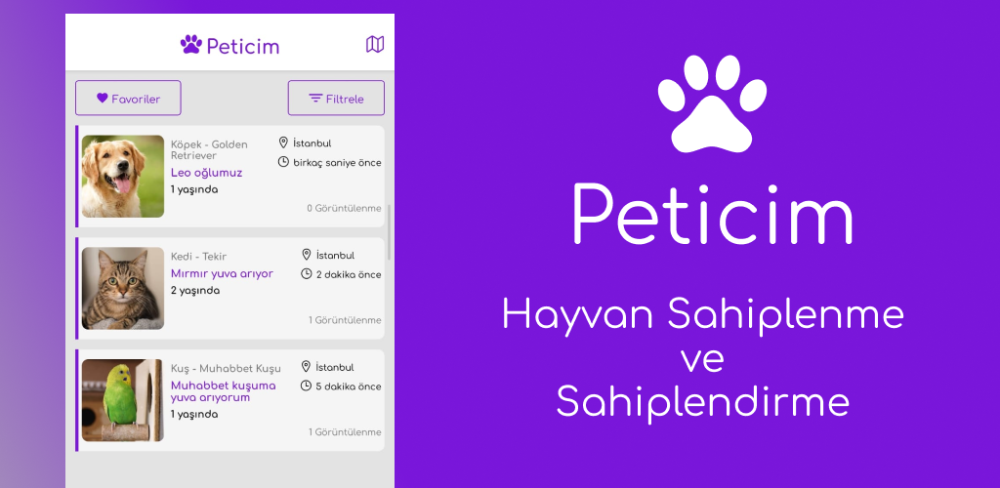
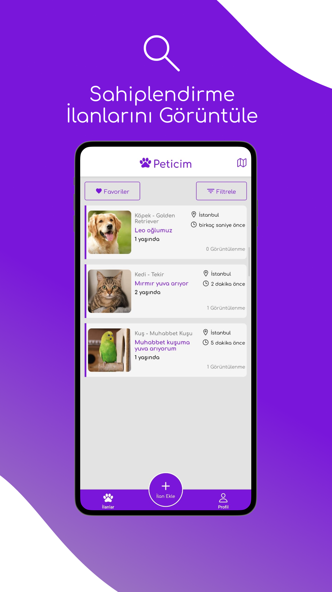
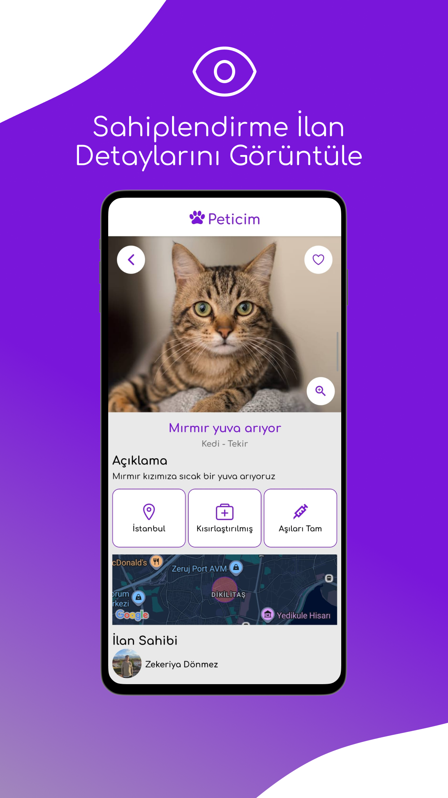
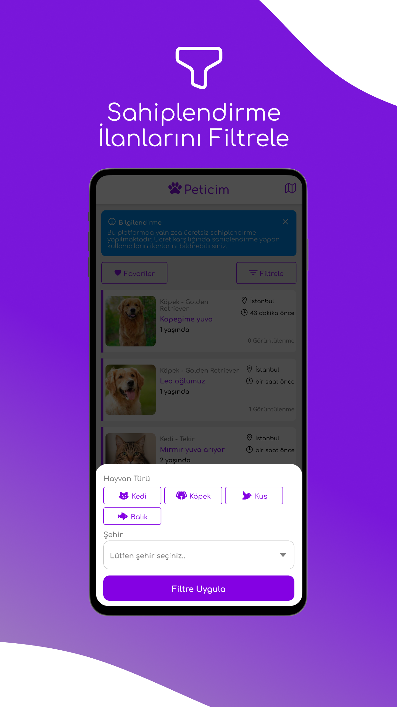
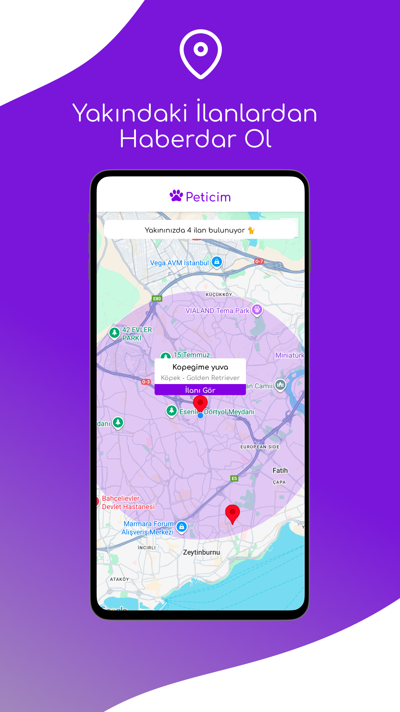
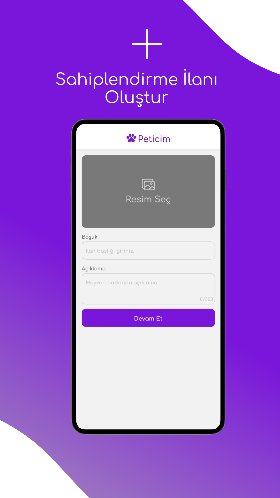

<div align="center">
  </br>
</div>

## 🏗️ Proje Yapısı

```
peticim/
├── src/
│ ├── components/
│ ├── screens/
│ ├── context/
│ ├── services/
│ └── utils/
├── assets/
├── app.json
├── package.json
└── README.md
```

## ✨ Uygulama Özellikleri:

- Hayvan sahiplendirme ilanı oluşturma (Hayvan ile ilgili; fotoğraf, başlık, açıklama, aşı durumu, kısırlaştırma durumu gibi bilgiler girilerek sahiplendirme ilanı oluşturulur)
- İlan detaylarını görüntüleme (Paylaşılmış ilanların detaylarını tekil sayfalarında görüntüleme)
- Hayvan türü, şehir ve ilçe bazlı filtreleme
- İlan sahibine mesaj göndermek için WhatsApp yönlendirmesi
- Uygunsuz ilanlar için raporlama
- İlan favorileme, favori ilanları görüntüleyebilme
- Harita üzerinden konuma yakın ilanları görüntüleyebilme
- Başka bir kullanıcının ilanlarını listeleyebilme

## ⚙️ Kullanılan Teknolojiler

- React Native (Mobil Önyüz / Frontend)
- Next.JS, React (Admin Panel Frontend)
- NodeJS, MongoDB (Backend)
- Figma (Uygulama Tasarımları)
- Context API (State Yönetimi)
- Firebase (Auth & Database)
- Cloudinary API (Fotoğraf Depolama)
- Sentry (Hata Loglama)

## 📸 Uygulama Görselleri

<div align="center">
  <table>
    <tr>
      <td></td>
      <td></td>
      <td></td>
    </tr>
    <tr>
      <td colspan="3" align="center">
        
        
      </td>
    </tr>
  </table>
</div>

### 📪 İletişim & Öneriler

📧 [ceng.zekeriyadonmez@gmail.com](mailto:ceng.zekeriyadonmez@gmail.com)  
🌐 [zecky.dev](https://zecky.dev)  
💼 [LinkedIn](https://www.linkedin.com/in/zekeriyadonmez/)
